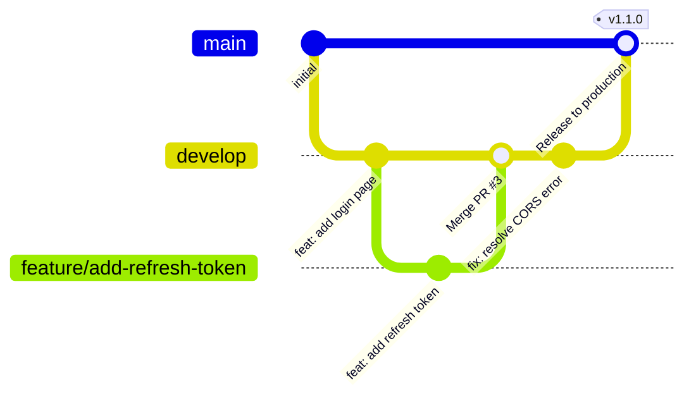

# コーディング規約

このプロジェクトに貢献する際のコーディング規約です。

---

## Biome（自動チェック）

[Biome](https://biomejs.dev/) を linter / formatter として使用しています。
`git commit` 時に pre-commit フックが `biome check --write` を自動実行します。
インデント・クォート・セミコロン・import 整列など書式は**すべて自動修正**されるので、
意識しなくてかまいません。詳細は [`biome.json`](biome.json) を参照してください。

手動確認・修正するには:

```bash
npm run check   # lint + format チェック
npm run format  # フォーマットのみ自動修正
```

---

## 書くときに意識すること

Biome が自動修正できないルールです。コードを書く段階で意識してください。

### Node.js 組み込みモジュールは `node:` プロトコルで import する

```ts
import crypto from "node:crypto";  // ✅
import crypto from "crypto";       // ❌ lint エラー
```

### `<button>` には `type` 属性を付ける

省略するとフォームの submit ボタンとして動作し、意図しない送信が起きることがあります。

```tsx
<button type="button" onClick={...}>クリック</button>  // ✅
<button onClick={...}>クリック</button>               // ❌ lint エラー
```

### lint ルールを抑制する場合は理由を記載する

非 null アサーション（`!`）など禁止されているパターンを使わざるを得ない場合は、
`biome-ignore` コメントで個別に抑制し、必ず理由を書いてください。

```ts
// biome-ignore lint/style/noNonNullAssertion: root 要素は index.html が保証する
ReactDOM.createRoot(document.getElementById("root")!).render(...);
```

---

## 命名規則

| 対象 | 規則 | 例 |
|---|---|---|
| React コンポーネントファイル | PascalCase | `Home.tsx`, `Protected.tsx` |
| その他の TypeScript ファイル | camelCase | `auth.ts`, `app.ts`, `server.ts` |
| テストファイル | `*.test.ts` / `*.test.tsx` | `app.test.ts`, `Home.test.tsx` |
| 関数・変数 | camelCase | `buildAuthMiddleware`, `loadOrGenerateKeys` |
| グローバル定数 | SCREAMING\_SNAKE\_CASE | `PORT`, `ISSUER`, `CLIENT_ID` |
| 型・インターフェース | PascalCase | `AuthUser`, `ApiResult` |

---

## TypeScript

- ルートの `tsconfig.base.json` で `strict: true` を有効化しています。`any` や `as unknown` の使用は最小限にしてください。
- **型のエクスポート**は `export type` を使い、値と区別します
  ```ts
  export type AuthUser = { sub: string; email: string; groups: string[] };
  ```
- **`interface` vs `type`**: オブジェクト形状には `interface`、ユニオン型やエイリアスには `type` を使います
- **型引数は明示する**（`useState<string | null>(null)` 等）

---

## React コンポーネント

- **export**: `export default function ComponentName()` 形式を使います（named export は使いません）
- **スタイル**: ファイル末尾に `const styles: Record<string, React.CSSProperties> = { ... }` としてまとめます
- **`useEffect` の依存配列は省略しない**

---

## エラーハンドリング

- `catch (e)` の `e` は `unknown` 型です。文字列に変換する場合は `String(e)` を使います
- 非同期処理の後処理（loading フラグのリセット等）は `finally` ブロックに書きます

---

## テスト

- `describe` / `it` の説明は**日本語**で書きます
  ```ts
  describe("GET /api/me — 認証済み", () => {
    it("200 とユーザー情報を返す", async () => { ... });
  });
  ```
- `describe` のネスト: 「コンポーネント名 — 状態」→ `it` の形にします
- React Testing Library のテストでは **`afterEach(cleanup)` を必ず書きます**
- モジュールモックは `vi.mock(...)` の後に `await import(...)` でインポートします
  ```ts
  vi.mock("../auth", () => ({ userManager: { getUser: vi.fn() } }));
  const { userManager } = await import("../auth");
  ```

---

## コメント

このプロジェクトでは **「WHY のみコメントを書く」** 方針を採用しています。

- 関数名・変数名で WHAT（何をするか）を表現し、それ自体にはコメントを書きません
- コメントが必要な場合は、**非自明な制約・回避策・不変条件**など「なぜそう書いたか」に限定します

---

## ブランチ戦略



| ブランチ | 用途 | デプロイ先 |
|---|---|---|
| `main` | 本番リリース済みコード。直接 push 禁止 | 本番環境 |
| `develop` | 開発の統合ブランチ（デフォルト）。直接 push 禁止 | 検証環境 |
| `feature/<topic>` | 機能追加 | — |
| `fix/<topic>` | バグ修正 | — |
| `hotfix/<topic>` | 本番緊急修正（`main` から分岐し `main` と `develop` 両方にマージ） | — |
| `docs/<topic>` | ドキュメント変更のみ | — |
| `chore/<topic>` | 依存更新・ビルド設定など | — |

- `<topic>` はケバブケース（例: `feature/add-refresh-token`）
- 作業ブランチは `develop` から分岐し、`develop` に PR を出す
- `develop` → `main` のマージは CI + 検証環境でのテスト通過後に行う
- マージ済みのブランチは削除する

---

## コミットメッセージ

[Conventional Commits](https://www.conventionalcommits.org/) 形式を採用します。

```
<type>: <subject>
```

| type | 用途 |
|---|---|
| `feat` | 新機能 |
| `fix` | バグ修正 |
| `docs` | ドキュメントのみの変更 |
| `test` | テスト追加・修正 |
| `refactor` | 動作を変えないリファクタリング |
| `chore` | 依存更新・ビルド設定・CI など |
| `style` | フォーマット変更（動作に影響なし） |

- `<subject>` は英語・動詞の原形から始める（例: `add`, `fix`, `update`）
- 50 文字以内
- 末尾にピリオドを付けない
- 破壊的変更は `!` を付ける（例: `feat!: change auth token format`）

```
feat: add JWT refresh token support
fix: resolve CORS error on /api/me endpoint
docs: update README with AWS deployment steps
chore: bump vitest to 3.0
```

---

## プルリクエスト

- `main` / `develop` への直接 push は禁止。必ず PR を通す
- PR タイトルはコミットメッセージと同形式（`feat: ~` など）
- WIP の場合は **Draft PR** を使う
- マージ前の条件:
  - CI（lint・テスト）がすべて green
  - 1名以上の Approve
- 作業ブランチ → `develop` のマージは **Squash and merge** を推奨（`develop` の履歴を整理するため）
- `develop` → `main` のマージは検証環境での動作確認後に **Merge commit** を使用する（リリース履歴を残すため）
